# 编码器
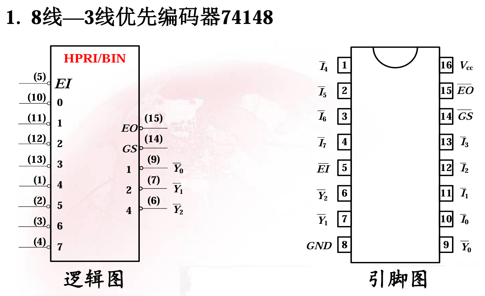
## 用两片74148构成16线—4线优先编码器
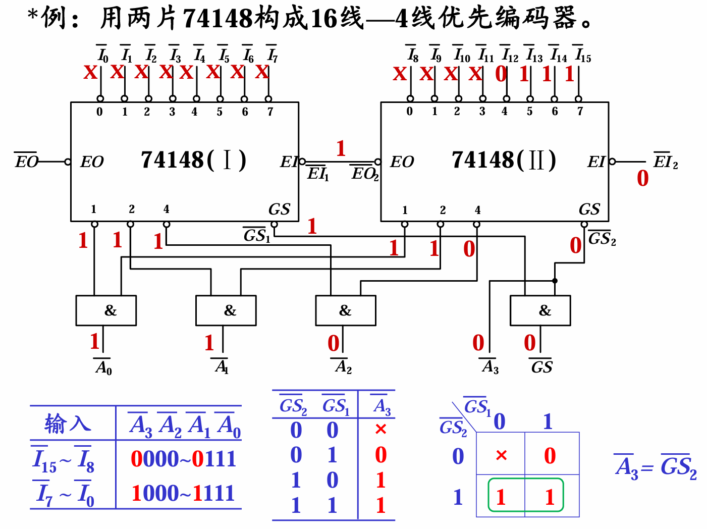
1. 输入 $\bar{I}_0 $~$ \bar{I}_{15}$ 、低位选通输出端 $\overline{EO}$、高位输入端 $\overline{EI}_2$ 单独接
2. 低位输出端 $\overline{EI}_1$ 接高位选通输出端  $\overline{EO}_2$
3. 两片的同一输出端接与门（ $\bar{A}_0$ 、$\bar{A}_1$ 、$\bar{A}_2$ 、$\overline{GS}$）
4. $\bar{A}_3 = \overline{GS}_2 $ 

## *问题思考： 
1）若用5片74148构成一个32线—5线编码器，电路如何设计？ 
2）若用9片74148构成一个64线—6线编码器，电路又如何设
计？                      
*扩展电路设计提示： 
1）观察上例编码器低三位输出电路结构，并找出规律； 
2）分析高位输出和各GS之间的关系，将GS作为输入，高位
信号作为输出，设计一输出电路。

## 用多片74148扩展编码器的设计

### 1. 基本扩展原理

74148为8线-3线优先编码器（低电平输入有效），其扩展输出端定义如下：

- **EO**（级联输出）：
  \[
  \overline{EO} = \overline{EI} \cdot \overline{I_0} \cdot \overline{I_1} \cdot \overline{I_2} \cdot \overline{I_3} \cdot \overline{I_4} \cdot \overline{I_5} \cdot \overline{I_6} \cdot \overline{I_7}
  \]
  当 \(\overline{EI}=0\) 且无有效输入时，\(\overline{EO}=0\)；否则 \(\overline{EO}=1\)。

- **GS**（组信号输出）：
  \[
  \overline{GS} = \overline{EI} \cdot (I_0 + I_1 + I_2 + I_3 + I_4 + I_5 + I_6 + I_7)
  \]
  当 \(\overline{EI}=0\) 且有有效输入时，\(\overline{GS}=0\)；否则 \(\overline{GS}=1\)。

扩展的核心思想：
1. 将输入分为若干组，每组接一片74148，组间优先级由级联顺序决定。
2. 各片的 \(\overline{Y_2}\overline{Y_1}\overline{Y_0}\)（反码）通过“线与”合并得到低三位地址（反码）。
3. 各片的 \(\overline{GS}\) 信号作为另一片74148的输入，其输出经反相后得到高几位地址。

### 2. 用5片74148构成32线-5线编码器

#### 2.1 总体结构
- 32个输入信号 \(\overline{I_0} \sim \overline{I_{31}}\) 分成4组，每组8个信号，分别接入4片74148（称为 \(U_3\)、\(U_2\)、\(U_1\)、\(U_0\)），优先级：\(U_3\) 最高（输入31~24），\(U_0\) 最低（输入7~0）。
- 第5片74148（\(U_4\)）用作组编码器，产生高两位地址。

#### 2.2 级联连接
\[
\overline{EI}_{U_3} = 0 \quad (\text{接地})
\]
\[
\overline{EI}_{U_2} = \overline{EO}_{U_3}
\]
\[
\overline{EI}_{U_1} = \overline{EO}_{U_2}
\]
\[
\overline{EI}_{U_0} = \overline{EO}_{U_1}
\]
\(U_0\) 的 \(\overline{EO}\) 悬空（或接高电平）。

#### 2.3 低三位输出（\(\overline{A_2}\overline{A_1}\overline{A_0}\)）
各片的 \(\overline{Y_2}\)、\(\overline{Y_1}\)、\(\overline{Y_0}\) 分别通过“线与”合并（实际使用与门）：

\[
\overline{A_2} = \overline{Y_{2}^{(U_3)}} \cdot \overline{Y_{2}^{(U_2)}} \cdot \overline{Y_{2}^{(U_1)}} \cdot \overline{Y_{2}^{(U_0)}}
\]
\[
\overline{A_1} = \overline{Y_{1}^{(U_3)}} \cdot \overline{Y_{1}^{(U_2)}} \cdot \overline{Y_{1}^{(U_1)}} \cdot \overline{Y_{1}^{(U_0)}}
\]
\[
\overline{A_0} = \overline{Y_{0}^{(U_3)}} \cdot \overline{Y_{0}^{(U_2)}} \cdot \overline{Y_{0}^{(U_1)}} \cdot \overline{Y_{0}^{(U_0)}}
\]

若需要原码 \(A_2A_1A_0\)，可将上述反码再取反：
\[
A_2 = \overline{\overline{A_2}},\quad A_1 = \overline{\overline{A_1}},\quad A_0 = \overline{\overline{A_0}}
\]

#### 2.4 高两位输出（\(A_4A_3\)）
将 \(U_3 \sim U_0\) 的 \(\overline{GS}\) 输出分别接入 \(U_4\) 的输入 \(\overline{I_0}\sim\overline{I_3}\)（优先级对应：\(U_3\) 的 \(\overline{GS}\) 接 \(\overline{I_3}\)，\(U_2\) 接 \(\overline{I_2}\)，\(U_1\) 接 \(\overline{I_1}\)，\(U_0\) 接 \(\overline{I_0}\)），\(U_4\) 的 \(\overline{I_4}\sim\overline{I_7}\) 接高电平（无效）。  
\(U_4\) 的 \(\overline{EI}=0\)，其输出 \(\overline{Y_2}\overline{Y_1}\overline{Y_0}\) 即为组地址的反码，取低两位反相后得到 \(A_4A_3\)：

\[
A_4 = \overline{\overline{Y_1}^{(U_4)}}, \quad A_3 = \overline{\overline{Y_0}^{(U_4)}}
\]
（因组数4只需2位地址，\(\overline{Y_2}^{(U_4)}\) 反相后为1，可忽略）

#### 2.5 结果图
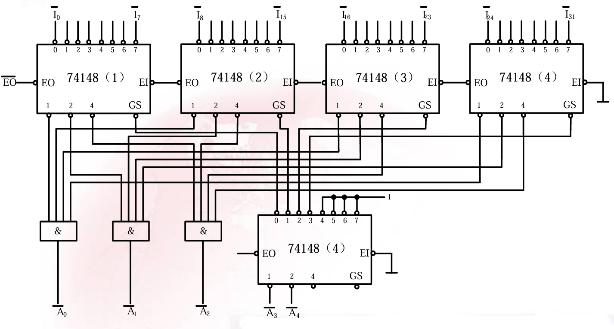

### 3. 用9片74148构成64线-6线编码器

#### 3.1 总体结构
- 64个输入分成8组，每组8线，接入8片74148（\(U_7 \sim U_0\)），优先级 \(U_7\) 最高（63~56），\(U_0\) 最低（7~0）。
- 第9片74148（\(U_8\)）用作组编码器，产生高3位地址。

#### 3.2 级联连接
\[
\overline{EI}_{U_7} = 0
\]
\[
\overline{EI}_{U_6} = \overline{EO}_{U_7},\quad
\overline{EI}_{U_5} = \overline{EO}_{U_6},\quad
\ldots,\quad
\overline{EI}_{U_0} = \overline{EO}_{U_1}
\]

#### 3.3 低三位输出（\(\overline{A_2}\overline{A_1}\overline{A_0}\)）
\[
\overline{A_2} = \prod_{i=0}^{7} \overline{Y_{2}^{(U_i)}},\quad
\overline{A_1} = \prod_{i=0}^{7} \overline{Y_{1}^{(U_i)}},\quad
\overline{A_0} = \prod_{i=0}^{7} \overline{Y_{0}^{(U_i)}}
\]

#### 3.4 高三位输出（\(A_5A_4A_3\)）
将 \(U_7 \sim U_0\) 的 \(\overline{GS}\) 输出分别接入 \(U_8\) 的输入 \(\overline{I_7}\sim\overline{I_0}\)（优先级对应：\(U_7\) 的 \(\overline{GS}\) 接 \(\overline{I_7}\)，\(U_6\) 接 \(\overline{I_6}\)，…，\(U_0\) 接 \(\overline{I_0}\)）。  
\(U_8\) 的 \(\overline{EI}=0\)，其输出 \(\overline{Y_2}\overline{Y_1}\overline{Y_0}\) 即为组地址的反码，反相后得到 \(A_5A_4A_3\)：

\[
A_5 = \overline{\overline{Y_2}^{(U_8)}},\quad
A_4 = \overline{\overline{Y_1}^{(U_8)}},\quad
A_3 = \overline{\overline{Y_0}^{(U_8)}}
\]

您说得对，原总结中“组编码器需要1片”只适用于 \( m \leq 8 \) 的情况。下面给出**通用版本**的扩展规律总结，并明确“低位输出”是指**低3位**。

## 扩展规律总结
设需要扩展的输入线总数为 \(N = 8 \times m\)（\(m\) 组），则：
- 输入级需要 \(m\) 片74148，组编码器需要1片，共 \(m+1\) 片。
- 输出位数 = \(3 + \lceil \log_2 m \rceil\)。
- 级联顺序：优先级最高的片 \(\overline{EI}\) 接地，其余各片的 \(\overline{EI}\) 接前一片的 \(\overline{EO}\)。
- 低位输出：所有输入片的相同 \(\overline{Y}\) 脚通过 \(m\) 输入与门合并。
- 高位输出：所有输入片的 \(\overline{GS}\) 脚作为组编码器的输入，组编码器的输出反相即得高位地址。
>因为74148只有三位输出，所以是低三位更新这个

> 说明：当组编码器 $\geq 2$ 时， 其实相当于一个之前已经实现过的编码器。比如说128线-7位组编码器的高位输出就是一个16线-2位编码器

# 译码器
## 2线—4线译码器
### 由两片2线—4线译码器组成3线—8线译码器
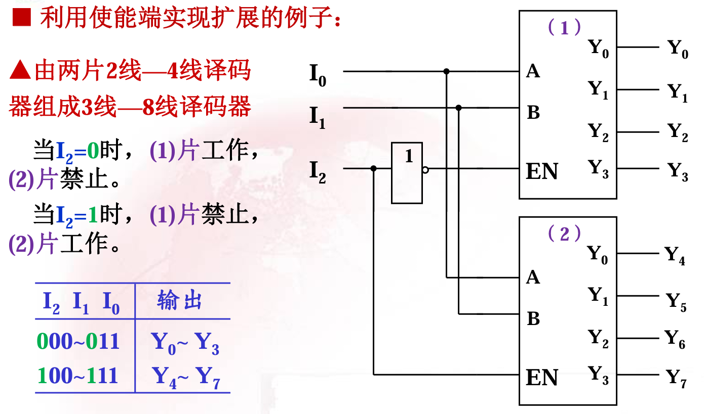
1. 输入 $I_0 $~$ I_1 $ 接对应输入（都是一样的）
2. 引入新的一位 $I_2$ 接高位，非接低位。相当于1线-2线译码器。
### 由2线—4线译码器组成4线—16线译码器
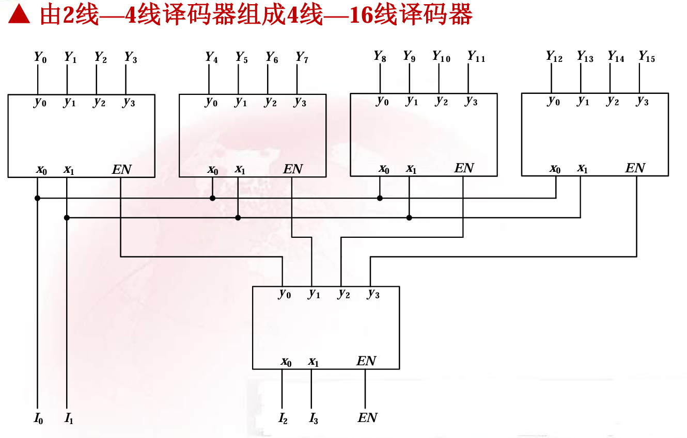
1. 输入 $I_0 $~$ I_1 $ 接对应输入（都是一样的）
2. 引入新的两位 $I_2 $~$ I_3 $ 如2线-4线译码器，其输出对应。
### 扩展规则
#### 1. 基本扩展原理

以2线-4线译码器（如74x139，低电平输出有效，带一个低有效使能端\(\overline{G}\)）为例。其输出表达式为：
\[
\overline{Y}_i = \overline{m}_i \cdot \overline{G}
\]
其中 \(m_i\) 为地址 \(A_1A_0\) 对应的最小项，\(\overline{G}=0\) 时译码器工作。

扩展的核心思想：利用使能端进行片选，将高位地址线连接到各片的使能端，低位地址线并联到各片的地址输入端。所有译码器的输出直接并联（因为同一时刻只有一片工作，其余输出为高电平）。

#### 2. 一般扩展规则

设需要扩展的译码器输出线总数为 \(N = 4 \times m\)（\(m\) 片2线-4线译码器，每片4输出），地址线位数 \(n = \log_2 N = 2 + \lceil \log_2 m \rceil\)。

- **所需芯片**：\(m\) 片2线-4线译码器。当 \(m > 4\) 时，还需要额外的译码器（如另一片2-4译码器）来产生片选信号。
- **地址分配**：
  - 低2位地址（\(A_1A_0\)）并联到所有译码器的地址输入端。
  - 高 \(\lceil \log_2 m \rceil\) 位地址（\(A_{n-1} \cdots A_2\)）用于产生各片的使能信号。
- **片选信号产生**：
  - 若 \(m \leq 4\)：可直接将高位地址线（或它们的组合）连接到各片的使能端（低有效）。例如 \(m=4\) 时，需要2位高位地址 \(A_3A_2\)，经过一个2线-4线译码器（或直接组合逻辑）产生4个使能信号，分别接至各片。
  - 若 \(m > 4\)：需将高位地址线经过一个额外的译码器（级联）产生 \(m\) 个使能信号，按优先级或唯一地址选择各片。
- **输出连接**：所有译码器的输出端按顺序排列直接并联，形成 \(N\) 个低有效输出端。因为任何时刻只有一片被使能，其余片输出全为高电平，所以不会发生冲突。

##　3线－8线译码器
### 用两片74138构成4线—16线译码器
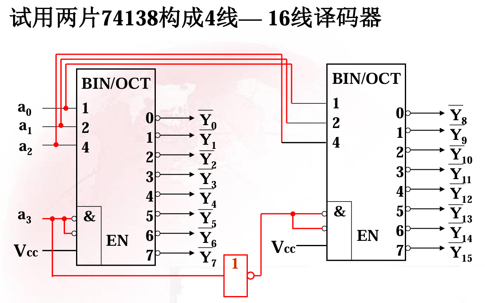
扩展思路同2线-34线译码器，只不过由于74138的输出是 $\bar{m}_i$ ，所以片选信号的非需要接高位译码器（2线-4线是接低位译码器）
### 一般扩展规则
用 \( m \) 片 74138 构成 \( N = 8 \times m \) 线译码器
- 总地址线位数：\( n = 3 + \lceil \log_2 m \rceil \)
- 低 3 位地址 \( A_2, A_1, A_0 \) 并联到所有片
- 高 \( n-3 \) 位地址用于产生 \( m \) 个片选信号  
  - 若 \( m \le 8 \)：可用一个 \( (n-3) \) 线‑\( m \) 线译码器（如另一片 74138 或门电路）产生片选，其低有效输出直接接至各片的 \( \overline{G}_{2A} \)（或 \( \overline{G}_{2B} \)），并令各片 \( G_1 = 1 \)、另一低有效使能端接 0。
  - 若 \( m > 8 \)：需要多级译码器树形扩展，规则相同（每级使用 74138 将更高位地址译码，产生的输出作为下一级片的使能信号）。
- 所有片的输出按顺序直接并联，构成完整的 \( N \) 个低有效输出。

### 示例
- **4 线‑16 线**：2 片 74138 + 1 个非门  
- **5 线‑32 线**：4 片 74138 + 1 片 2 线‑4 线译码器（或 1 片 74138 的 4 个输出）  
- **6 线‑64 线**：8 片 74138 + 1 片 74138（作为 3 线‑8 线片选译码器）

# 数据选择器
## 四选一数据选择器
### 由四选一数据选择器组成十六选一数据选择器
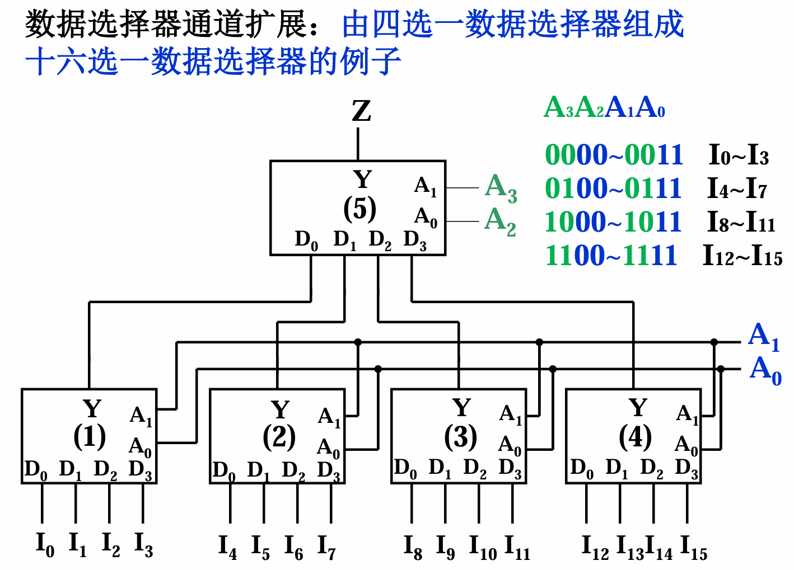
1. 输入的数据正常接入
2. 低位地址码接低位所有数据选择器
3. 高位地址码接高位数据选择器
4. 每一个低位地址选择器的输出接高位数据选择器的数据
### 一般扩展规则
#### 基本特性
- 地址输入端：\( A_1, A_0 \)（2位）
- 数据输入端：\( D_0, D_1, D_2, D_3 \)
- 输出：\( Y = \overline{A_1}\overline{A_0}D_0 + \overline{A_1}A_0D_1 + A_1\overline{A_0}D_2 + A_1A_0D_3 \)
- 通常带有使能端（低有效），扩展时可统一接地。

#### 一般扩展规则（树形结构）
- 若需实现 \( N = 4^k \) 选一，则需 \( k \) 级树形级联。
- 第一级：\( 4^{k-1} \) 片，处理原始数据，地址为最低2位。
- 第二级：\( 4^{k-2} \) 片，处理第一级的输出，地址为次低2位。
- 依此类推，最后一级为1片，地址为最高2位。
- 总片数：\( \frac{4^k - 1}{3} \)。

#### 示例：用四选一数据选择器构成六十四选一

- **级数**：\( k = 3 \) 级
- **总片数**：\( \frac{4^3 - 1}{3} = \frac{64 - 1}{3} = 21 \) 片
- **地址分配**：6位地址 \( A_5A_4A_3A_2A_1A_0 \)，分为3组，每组2位：
  - 最低2位 \( A_1A_0 \)：第一级（16片）的地址
  - 中间2位 \( A_3A_2 \)：第二级（4片）的地址
  - 最高2位 \( A_5A_4 \)：第三级（1片）的地址

**连接方式**：
1. **第一级（16片）**：每片四选一的数据输入端接4路原始数据（共64路）。所有第一级片的地址输入端并联，接 \( A_1A_0 \)。16片输出 \( Y_0 \sim Y_{15} \) 分别进入第二级。
2. **第二级（4片）**：每片四选一的数据输入端接4个第一级片的输出（例如第1片接 \( Y_0 \sim Y_3 \)，第2片接 \( Y_4 \sim Y_7 \)，依此类推）。地址输入端并联，接 \( A_3A_2 \)。4片输出 \( Z_0 \sim Z_3 \) 进入第三级。
3. **第三级（1片）**：数据输入端接第二级的4个输出 \( Z_0 \sim Z_3 \)，地址输入端接 \( A_5A_4 \)。其输出即为六十四选一的最终结果。

**扩展要点**：
- 所有低一级选择器的输出连接到高一级选择器的数据输入端。
- 每一级的地址线互不重叠（覆盖所有地址位）。
- 若输入路数不是4的幂，可适当接地或接固定电平处理多余输入端。

## 双四选一MUX74153
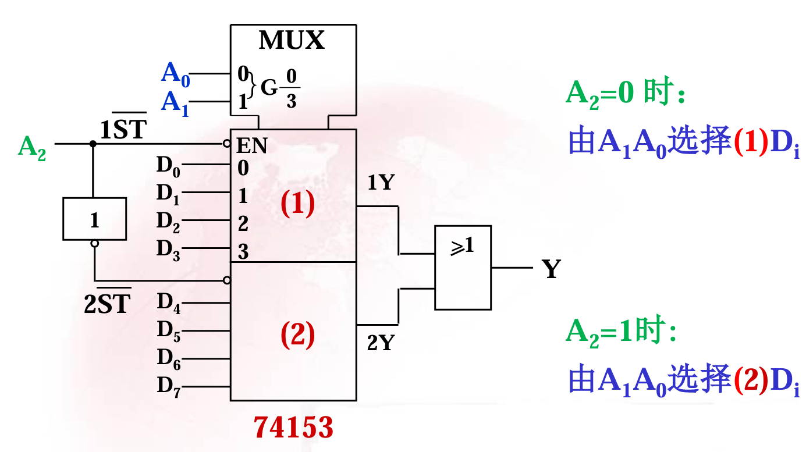
引入一个新的量作为1线-2线译码器。由于输入是低电平有效，所以高位为非。

# 数值比较器74HC85
## 串行扩展
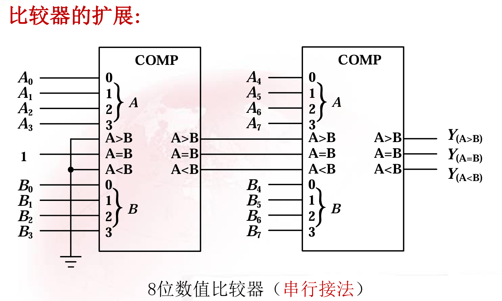
1. 输入征程正常接入
2. 最低位输入的 $>$ 和 $<$ 接0，$=$ 接1
3. 低位输出的 $>$  、 $<$  、 $=$ 接到高位的输入的 $>$  、 $<$  、 $=$ 。

>接法：
对于更多位（例如 16 位、32 位等），数值比较器 74HC85 的串行扩展方法完全一致，只是需要更多片级联。

## 串行接法通用规则（N 位，N 为 4 的倍数）

- **所需芯片数**：\( \frac{N}{4} \) 片 74HC85
- **连接顺序**：将数据按 4 位一组从低到高划分，每组接入一片 74HC85
- **级联连接**：
  - 最低位片（比较第 0~3 位）的级联输入固定为：\( I_{A>B}=0 \)，\( I_{A<B}=0 \)，\( I_{A=B}=1 \)
  - 最低位片的三个输出 （\( Y_{A>B}, Y_{A<B}, Y_{A=B} \)） 分别接至次低位片的对应级联输入端
  - 依此类推，直到最高位片
- **最终输出**：最高位片的三个输出即为整个 N 位数的比较结果

## 并行扩展
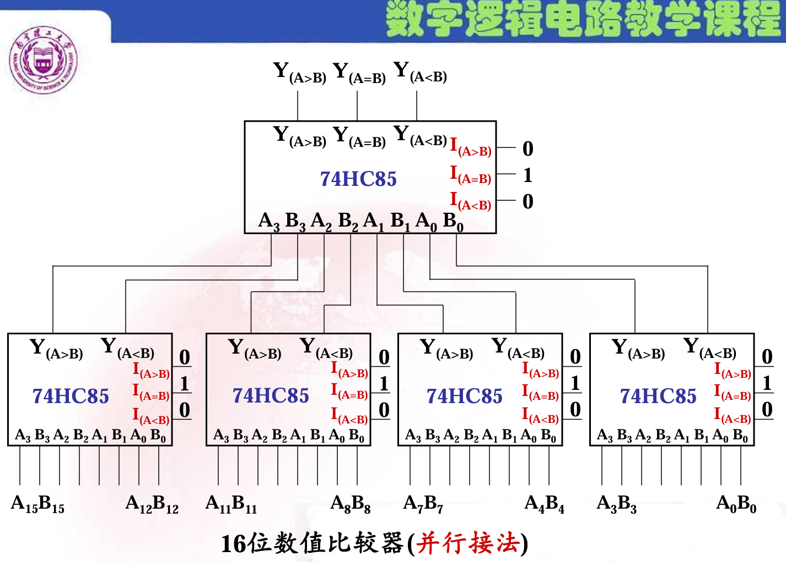
1. 数据正常接入（ $A_{15} $~$ A_{0}$ 和 $B_{15} $~$ B_{0}$）
2. 所有的级联输入接法： $>$ 和 $<$ 接0，$=$ 接1
3. 数值比较器的结果 $Y_{A>B}$ （接 $A$）、 $Y_{A<B}$ （接 $B$）按照从高到低接入最终的输出

## 并行接法通用规则（N 位，N 为 4 的倍数）

- **所需芯片数**：
  $ \frac{N}{4} $ 片 74HC85 作为最低层比较（直接比较每组 4 位数据），$ \frac{N}{4^2} $ 片 74HC85 作为次低层比较（将低层输出的比较结果编码后作为数据输入），以此类推，直到最顶层剩 1 片。总片数为 $$ \frac{N}{4} + \frac{N}{4^2} + \cdots + 1 = \frac{N-4}{12} $$（当 N 为 4 的幂时）。

- **连接方式**：
  - 级联输入：固定为 $$ I_{A>B}=0,\; I_{A<B}=0,\; I_{A=B}=1 $$
  - 最低层芯片：每片独立接入对应的 4 位数据组（$ A_{4i+3}\cdots A_{4i} $ 和 $ B_{4i+3}\cdots B_{4i} $）
  - 高层芯片：将低一层的比较结果按照顺序规则（输入高位接高位）接入，$Y_{A>B}$ 接 $A$、 $Y_{A<B}$ 接 $B$ 。

- **合并规则**：从最低层开始，每两个（或每四个）相邻组的比较结果被上一层的芯片进一步比较，按照高位优先的原则（高层芯片比较的是低层芯片输出的“虚拟数据”，其中编码了“大于/小于/等于”信息）。这种树形结构保证了比较结果可以在对数级延迟内产生。

- **最终输出**：顶层芯片的三个输出 $ Y_{A>B}, Y_{A<B}, Y_{A=B} $ 即为整个 N 位数的比较结果。

# 模10计数器
## 74290
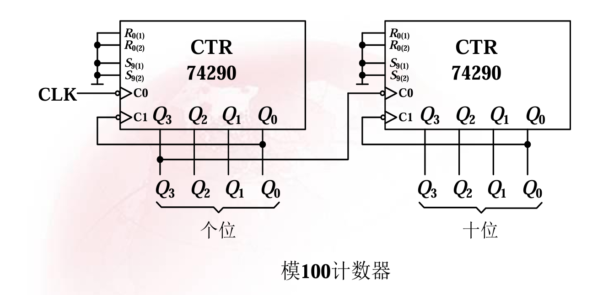
1. R、S全部接地
2. $Q_i$ 正常接入
3. $Q_0$ 都接入$C_1$
4. 个位时钟外部接入，十位时钟输入为${Q_0}^{n+1}$，即个位计数到9时提供时钟信号。
## 74160
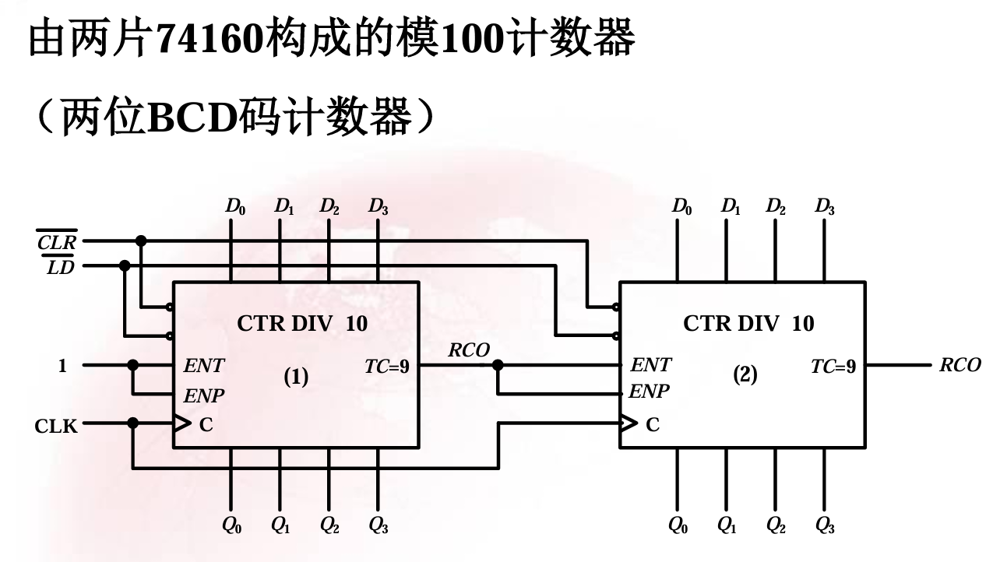
1. $\overline{CLR}$ 、$\overline{LD}$ 、$CLK$ 接入相同值
2. 数据初始值接入相同值 $ D_0 $~$ D_3$
3. 个位的 $ENT$ 和 $ENT$ 全部接入1，。高位的 $ENT$ 和 $ENT$ 接入低位输出 $RCO$。

# 移位寄存器
## 用两片74194接成八位双向移位寄存器 
### 一、74194 基本功能回顾
- 4 位双向移位寄存器，具有异步清零（\( \overline{CLR} \)）、模式控制端 \( S_1, S_0 \)：
  - \( S_1S_0 = 00 \)：保持
  - \( S_1S_0 = 01 \)：右移（串行输入 \( D_{SR} \) 移入 \( Q_0 \)，\( Q_0 \to Q_1 \to Q_2 \to Q_3 \)，\( Q_3 \) 移出）
  - \( S_1S_0 = 10 \)：左移（串行输入 \( D_{SL} \) 移入 \( Q_3 \)，\( Q_3 \to Q_2 \to Q_1 \to Q_0 \)，\( Q_0 \) 移出）
  - \( S_1S_0 = 11 \)：并行置数（\( D_0 \sim D_3 \) → \( Q_0 \sim Q_3 \)）
- 时钟 \( CLK \) 上升沿有效。

### 二、两片级联成 8 位双向移位寄存器的连接方法
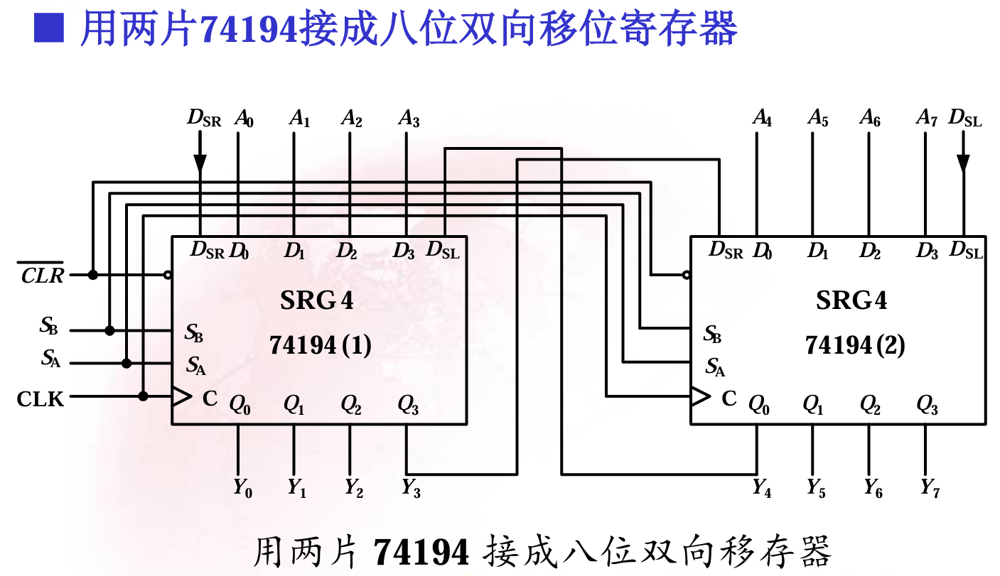
设两片 74194 分别为 **U0（低 4 位）** 和 **U1（高 4 位）**。  
总数据位：\( Q_7Q_6Q_5Q_4 \)（来自 U1）和 \( Q_3Q_2Q_1Q_0 \)（来自 U0）。

#### 2.1 公共信号连接
- 两片的 \( \overline{CLR} \)、\( CLK \)、\( S_1 \)、\( S_0 \) 分别并联（由外部统一控制）。
- 两片的并行置数输入端：U0 接 \( D_3D_2D_1D_0 \)（低 4 位），U1 接 \( D_7D_6D_5D_4 \)（高 4 位）。

#### 2.2 右移模式（\( S_1S_0=01 \)）
- 右移时数据从低位移向高位：U0 的 \( Q_3 \)（自身最高位）应移入 U1 的最低位。
- 连接：将 **U0 的 \( Q_3 \)** 接至 **U1 的右移串行输入端 \( D_{SR} \)**。
- U0 的 \( D_{SR} \) 接外部右移串行输入 \( SER_{IN} \)（总串入）。
- U1 的 \( Q_7 \) 为总串出。

#### 2.3 左移模式（\( S_1S_0=10 \)）
- 左移时数据从高位移向低位：U1 的 \( Q_4 \)（自身最低位）应移入 U0 的最高位。
- 连接：将 **U1 的 \( Q_4 \)** 接至 **U0 的左移串行输入端 \( D_{SL} \)**。
- U1 的 \( D_{SL} \) 接外部左移串行输入 \( SER_{IN} \)（总串入）。
- U0 的 \( Q_0 \) 为总串出。

## 更高位扩展规则

### 一、基本级联思想
- 每片 74194 提供 4 位存储。要构成 \( 4k \) 位双向移位寄存器，需 \( k \) 片级联。
- 级联时所有片的控制信号（\( \overline{CLR} \)、\( CLK \)、\( S_1 \)、\( S_0 \)）并联，由外部统一控制。
- 数据通路按移位方向连接：右移时低位片的最高位输出接至高位片的最低位输入；左移时高位片的最低位输出接至低位片的最高位输入。

### 二、右移模式（\( S_1S_0 = 01 \)）级联
- **连接规则**：将低一片的 \( Q_3 \) 接至高一片的 \( D_{SR} \)（右移串行输入）
- **第一片**：\( D_{SR} \) 接外部右移串行输入 \( R_{in} \)
- **最后一片**：\( Q_3 \) 作为右移串行输出 \( R_{out} \)
- **示例（16位）**：用 4 片 74194（U0～U3）
  - U0.\( Q_3 \) → U1.\( D_{SR} \)
  - U1.\( Q_3 \) → U2.\( D_{SR} \)
  - U2.\( Q_3 \) → U3.\( D_{SR} \)
  - 外部 \( R_{in} \) → U0.\( D_{SR} \)，U3.\( Q_3 \) 输出 \( R_{out} \)

### 三、左移模式（\( S_1S_0 = 10 \)）级联
- **连接规则**：将高一片的 \( Q_0 \) 接至低一片的 \( D_{SL} \)（左移串行输入）
- **最后一片（最高位）**：\( D_{SL} \) 接外部左移串行输入 \( L_{in} \)
- **第一片（最低位）**：\( Q_0 \) 作为左移串行输出 \( L_{out} \)
- **示例（16位）**（同上 4 片）
  - U3.\( Q_0 \) → U2.\( D_{SL} \)
  - U2.\( Q_0 \) → U1.\( D_{SL} \)
  - U1.\( Q_0 \) → U0.\( D_{SL} \)
  - 外部 \( L_{in} \) → U3.\( D_{SL} \)，U0.\( Q_0 \) 输出 \( L_{out} \)

### 四、并行置数（\( S_1S_0 = 11 \)）
- 所有片的数据输入端 \( D_0 \sim D_3 \) 分别接对应的外部并行输入（低位片接低 4 位，高位片接高 4 位）。
- 时钟上升沿时，8 位（或 16 位、32 位）数据同时置入所有触发器。

### 五、其他控制
- **异步清零**：所有片的 \( \overline{CLR} \) 并联，低电平清零。
- **保持**：\( S_1S_0 = 00 \) 时，输出不变。

### 六、推广至 \( 4k \) 位
- **所需片数**：\( k \) 片
- **右移级联链**：低位片 \( Q_3 \) → 高位片 \( D_{SR} \)，首片 \( D_{SR} \) 接总右串入，末片 \( Q_3 \) 为总右串出。
- **左移级联链**：高位片 \( Q_0 \) → 低位片 \( D_{SL} \)，末片 \( D_{SL} \) 接总左串入，首片 \( Q_0 \) 为总左串出。
- **并行置数**：各片数据输入端按位分配。
- **控制信号**：所有片共用 \( \overline{CLR} \)、\( CLK \)、\( S_1 \)、\( S_0 \)。

